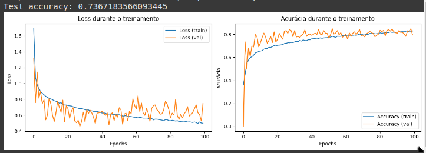
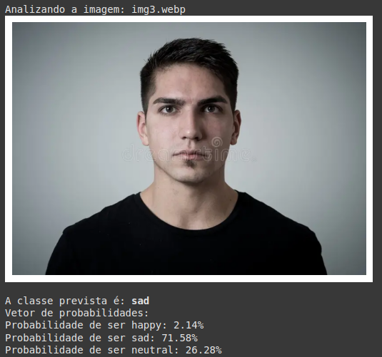

## Resultados teste 1:
- Não reconhece faces neutras adequadamente;

## hipóteses/idéias:
- Eliminar faces neutras do conjunto de treinamento/teste (substituir por expressões básicas)(talvez elas estejam causando ambiguidade);
- Usar Data Augmentation

## Resultados gerais:

## Teste prático:

